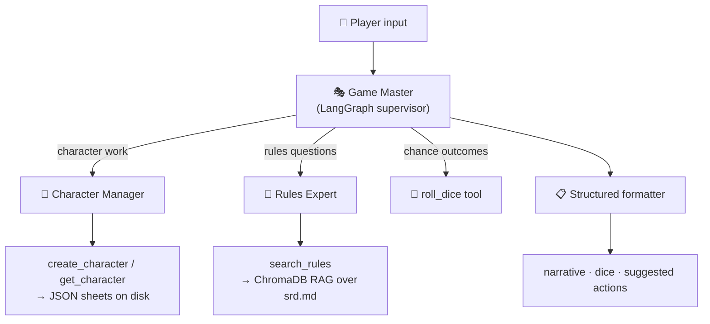

<div align="center">

# 🐉 Dungeons & Dragons — AI Game Master

### A multi-agent AI Dungeon Master that runs entirely on your own machine.

Built with **LangGraph** · **LangChain** · **Ollama** · **ChromaDB** · **Next.js**

No API keys. No cloud. Just you, a local LLM, and a d20. 🎲

[](https://www.python.org/)
[](https://langchain-ai.github.io/langgraph/)
[](https://ollama.com/)
[](https://www.trychroma.com/)
[](https://nextjs.org/)

</div>

---

## 🎥 Demo

Watch the full walkthrough — a tour of all the code **and** a live demo of the game in action:

<div align="center">

[](https://youtu.be/fT_jtN0sJj8)

**[▶️ Watch on YouTube](https://youtu.be/fT_jtN0sJj8)**

</div>

---

## ✨ What is this?

A fully playable D&D campaign run by a team of AI agents. You type what your character does; the **Game Master** agent decides what happens — delegating to specialists instead of hallucinating:

- 🎭 **The Game Master** (supervisor) — narrates the story and routes every question to the right expert. It never invents stats or rules itself.
- 🧙 **The Character Manager** — creates characters with real 4d6-drop-lowest stat rolls and saves the sheets to disk as JSON.
- 📖 **The Rules Expert** — a RAG agent grounded in the rulebook (`rules/srd.md`) via a ChromaDB vector index. Try flying a rocket to the moon and it will politely tell you that's not how medieval fantasy works.
- 🎲 **The Dice Tool** — real randomness in Python, not LLM-made-up numbers. Supports full dice notation (`1d20`, `3d6+2`, …).

Every turn comes back as structured output — narration, any dice rolled, and 2–4 suggested next actions — so you always know what you could try next.

## 🏗️ Architecture



The whole stack runs on a **local Ollama model** (`gpt-oss:20b` for chat, `nomic-embed-text` for embeddings). Narration and structured formatting are split into two LLM passes, which keeps local models reliable — one model narrates freely, a second one only reformats into the schema.

## 📂 Project structure

```
├── backend/            # Python — the AI Game Master
│   ├── app/
│   │   ├── agents/     # game_master (supervisor), character_agent, rules_agent
│   │   ├── tools/      # dice roller, character create/fetch
│   │   ├── rag/        # ChromaDB index over the rulebook
│   │   ├── schemas.py  # structured GameMasterTurn output
│   │   ├── game.py     # one-turn game loop
│   │   └── cli.py      # play in the terminal
│   └── rules/srd.md    # the rulebook the Rules Expert is grounded in
└── dnd_ui/             # Next.js chat interface (LangGraph Agent Chat UI)
```

## 🚀 Quick start

### 1. Prerequisites

- [Ollama](https://ollama.com/) running locally (or on your LAN)
- Python 3.11+ and Node 20+

```bash
ollama pull gpt-oss:20b
ollama pull nomic-embed-text
```

### 2. Backend

```bash
cd backend
python -m venv .venv && source .venv/bin/activate
pip install -r requirements.txt
cp .env.example .env    # set OLLAMA_BASE_URL if Ollama isn't on localhost
```

**Play in the terminal:**

```bash
python -m app.cli
```

```
============================================================
  DUNGEONS & DRAGONS — AI Game Master
  Type your action each turn. Type 'quit' to exit.
============================================================

> Create a dwarf fighter named Bruenor and enter the tavern
```

**Or run it as a LangGraph server** (for the web UI):

```bash
langgraph dev
```

### 3. Web UI (optional)

```bash
cd dnd_ui
npm install
npm run dev
```

Open `http://localhost:3000`, point it at your LangGraph server (`http://localhost:2024`, graph `agent`), and play in a proper chat interface.

## 🧠 How it stays honest

| Problem with naive LLM DMs | How this project solves it |
|---|---|
| Makes up dice rolls | A real `random`-backed dice tool — the LLM never picks numbers |
| Invents character stats | Stats come from actual 4d6-drop-lowest rolls, persisted to JSON |
| Hallucinated rules | RAG over the rulebook; the Rules Expert answers *only* from retrieved text |
| Forgets the campaign | LangGraph checkpointing keeps the whole session in memory per thread |
| Local models break JSON | Free narration first, then a dedicated formatting pass with graceful fallback |

## 🛠️ Tech stack

- **[LangGraph](https://langchain-ai.github.io/langgraph/)** — agent orchestration + `langgraph-supervisor` for the GM
- **[LangChain](https://www.langchain.com/)** — agents, tools, structured output
- **[Ollama](https://ollama.com/)** — local inference (`gpt-oss:20b`)
- **[ChromaDB](https://www.trychroma.com/)** — vector store for the rules RAG
- **[Next.js](https://nextjs.org/) + [Agent Chat UI](https://github.com/langchain-ai/agent-chat-ui)** — the web front end

---

<div align="center">

**Roll for initiative.** ⚔️

*Made by [Shaurya Kumar](https://github.com/ShauryaKumar09) — don't forget to ⭐ the repo if you enjoyed it!*

</div>
